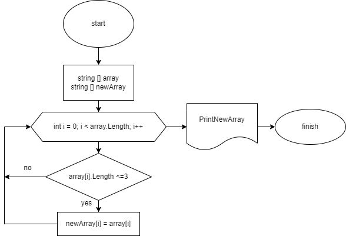

# Описание работы программы

## 1. Создаем первоначальный массив строк
* получаем от пользователя длину массива через функцию **ReadInt**
* через функцию **GetFirstArray** получаем от пользователя элементы, которые содержатся в массиве
* через функцию **PrintArray** выводим массив отдельной строкой 

## 2. Получаем новый массив строк
* в функции **GetNewArray** запускаем цикл, в котором перебираем все элементы массива
* если элемент массива содержим меньше или *три* знака, он записывается в новый массив
* если элемент больше, он пропускается и цикл повторяется заново
* через функцию **PrintNewArray** выводим отдельной строкой новый массив, содержащий только элементы равные трем или меньше трех

## 3. Блок-схема основного метода 

В прилагаемой блок-схеме описан метод получения нового массива, элементы которого удовлетворяют условиям <= 3.
